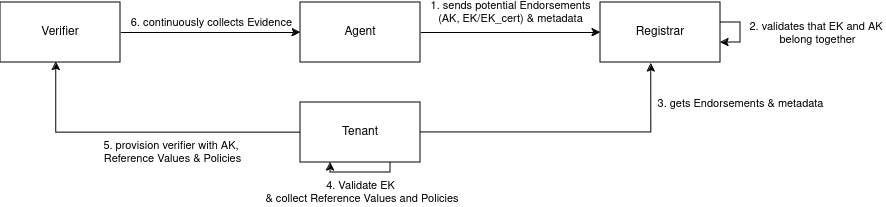

Mapping Keylime to Remote ATtestation procedureS (RATS) Architecture
====================================================================

Remote ATtestation procedureS (RATS) architecture (RFC 9334) defines general interactions, roles and concepts around Remote Attestation.

The initial design of Keylime predates the RATS architecture and sometimes the same terminology is used for different things. 
To differentiate every Keylime specific concept is written in *italic* and every RATS term is capitalized.
This document tries to unify both worlds and describes potential ideas for adopting more of the current standards around Remote Attestation.

Architecture
------------

Section 3. of the RATS architecture describes different roles that play a role during Remote Attestation. 
While those roles are not as explicitly defined in Keylime, they can be mapped to the existing components.

We get the following mapping to the RATS roles:

- *agent*: takes the role of the Attester (see security model for more details)
- *verifier*: takes the role of the Verifier and Relying Party
- *registrar*: provides a specific Trust Anchor to have a link between the AK, EK and EK certificate (also handles some attester meta data and in complex cases IDevID)
- *tenant*: takes the role of Reference Value Provider, Verifier Owner and Relying Party Owner, its also the Endorser in combination with the Trust Anchor provided by the *registrar*

Endorsements, Reference Values and Appraisal Policies
---------------------------------------------------

This section describes briefly where Endorsements, Reference Values and Appraisal Policies are used in Keylime.

The *tenant* adds the following to the *verifier*:

- runtime policy: Reference Values + Appraisal Policy
- tpm policy: Reference Values with implicit Appraisal Policy
- measured boot reference state: Reference Value used for pre-configured Appraisal Policy
- AK: Endorsement used for validating the TPM quote

See more details in the respective sections below.

Because Keylime reports only attestation failures, there is no separate Appraisal Policy of the Attestation Results. 
There is only the the possibility to differentiate attestation failures, based on their severity level. 
`See original proposal for more context <https://github.com/keylime/enhancements/blob/master/46_revocation_severity_and_context.md>`_.

Keylime supports reusing *policies* and the measured boot reference state between agents, which are then stored in the *verifier* by name.

Evidence Provided by the *agent*
--------------------------------

The Evidence consists of:

- TPM quote and signature: enocded TPM2B_ATTESTT and TPMT_SIGNATURE structures his is the encoded output of TPM2_Quote
- PCR values: encoded raw PCR values of the TPM
- TCG UEFI log: binary log of the TCG UEFI specified Measured Boot log
- IMA log: ASCII version of the IMA log
- transport key: a key used for payload mechanism. Is bound to PCR Quote via

Potential ways for standardization and improvements:

 - adoption of CMW 
    - find a standardized way for incremental logs
    - add media type for Keylime
 - move UEFI and IMA to TCG Canonical Event Log Format
 - standardize media types for TPM2B_PUBLIC and PCR values
 - deprecate transport key as part of the Evidence, instead verify it via the registrar and TPM2_Certify

Runtime Attestation
-------------------

Keylime provides runtime attestation functionality via the Linux Integrity Measurement Architecture. 
For this the IMA log in the Evidence is walked to compute the the running PCR value

The *runtime policy* contains the following:

- allowed files: map of path to list of hash digests
- excluded files: list of regexes to exclude files from Appraisal
- allowed kernel keyring: map of keyring names to list of hash digests
- verification keys: list keys used for IMA signature Appraisal
- meta data: various information not used for Appraisal
- allowed ima-buf entries: map of name to list of hash digests
- learn keys from keyring feature: use keys measured by IMA to appraise further entries

Currently there is no separation between Reference Values and Appraisal Policy. 
One possible way would be with the following Reference Values:

- allowed files: can be represented as CoSWIDs
- allowed kernel keyrings: can be represented as ???
- allowed ima-buf entires: can be represented as ???
- learned keys from measured keyring: those are Reference Values but are synthesized during Evidence validation
- (new) disallowed files: e.g. to deny old software versions explicitly, can be represented as CoSWID

Following parts would become parts of an Appraisal Policy:

- excluded files
- appraisal order of hashes and signatures
- if learned keys are used

Measured Boot Attestation
-------------------------

For measured boot attestation Keylime provides a policy DSL that can be used to evaluate UEFI event logs. 
Keylime ships by default an example policy that covers the basic use cases.
There have been experiments that used OPA policies, to replace this, but those have not made it into upstream.

Because the log can become very complex depending on the firmware, there is no good way to specify a Reference Value format to cover every use case.
Currently in Keylime the set of Reference Values in specified as a custom JSON object, that is defined based on the configured policy.  

The goal would be define a set of Reference Values that covers the most common use cases and actors. We have generally the following actors involved:

- firmware vendors
- hardware vendors
- distributions
- platform owners
- platform users

Further we need to provide general abstractions and primitives for building policies. Writing secure policies is difficult, as order of events matter and the event type's integrity is not protected.
This would include the following things:

- Checks for the fixed literals that are measured
- Consistency checks of certain event orders
- Abstraction to check key/hash DBs (e.g. PK, KEK, DB, DBX, MoK)

Note that the measured boot attestation can provide a Reference Value for the first entry in the IMA log, the `boot_aggregate`.

TPM Static PCR Attestation
--------------------------

Keylime gives the user also to just directly check the Evidence against a list of golden PCR values.

The potential action here is to split out the implicit Appraisal Policy into an explicit one. 
Further we would find a standardized structure to represent the map of PCR index to list of golden value.

Providing Attestation Result as an EAR
--------------------------------------

Currently Keylime only reports an Attestation Result when a failure happens. 
This works well in our operational model, but sometimes we want to convey that information also to other systems and in a standardized fashion.
`EAT Attestation Result <https://datatracker.ietf.org/doc/draft-fv-rats-ear/>`_ specifies a format on how this could look like.

The idea would be to provide an Durable Attestation plugin, that allows us to provide the Attestation Result of each round in form of an EAR to another Relying Party.
Further this would be then also used in the failure case, as it then provides standardized way to conveying this information, replacing our custom JSON structure.
Also the Attestation Result is formed by going through the attestation steps in a fixed order. Here the option of then Appraisal Policy for the Attestation Result could be introduced.